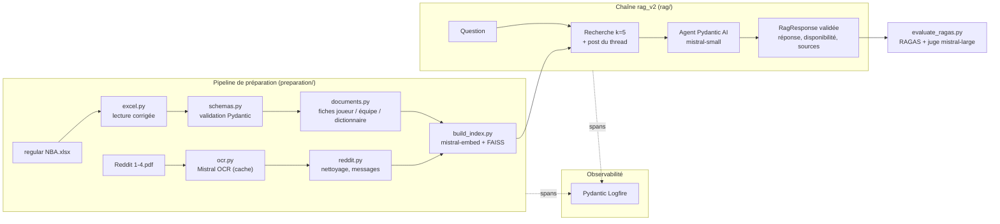

# SportSee : évaluation et fiabilisation d'un assistant RAG

Assistant d'analyse de performance NBA pour les entraîneurs, analystes et préparateurs
physiques de SportSee. Ce dépôt audite le prototype RAG existant, le mesure avec RAGAS,
reconstruit la préparation des données (validée par Pydantic), structure la réponse du LLM
avec Pydantic AI et trace toute la chaîne avec Pydantic Logfire.

| Étape | Contenu | État |
|---|---|---|
| 1. Évaluation structurée | Audit, `evaluate_ragas.py`, jeu de questions métier, pipeline de préparation (Pydantic, Pydantic AI), Logfire | ✅ |
| 2. Données Excel et outil SQL | Base SQLite, `load_excel_to_db.py`, `sql_tool.py`, agent | ⏳ |
| 3. Seconde évaluation | Comparaison prototype / rag_v2 / rag_sql, robustesse texte + chiffres | ⏳ |

## Résultats

Même jeu de 32 questions, même juge (`mistral-large-latest`), même modèle de réponse
(`mistral-small-latest`) et même nombre d'extraits (k = 5).

| Métrique (moyenne) | Prototype | rag_v2 |
|---|---|---|
| Exactitude de la réponse | 0,32 | **0,68** |
| Fidélité au contexte (faithfulness) | 0,27 | **0,82** |
| Rappel du contexte (context recall) | 0,28 | **0,71** |
| Précision du contexte | 0,45 | **0,59** |
| Pertinence (answer relevancy) | 0,70 | **0,83** |
| Refus sans invention (4 questions hors couverture) | 0 / 4 | **4 / 4** |
| Latence moyenne par question | 4,5 s | **1,4 s** |

Exactitude par catégorie :

| Catégorie | n | Prototype | rag_v2 |
|---|---|---|---|
| simple | 7 | 0,57 | 0,71 |
| complexe (filtres, agrégations) | 7 | 0,00 | 0,43 |
| bruitée (fautes, SMS, franglais) | 5 | 0,20 | 0,80 |
| texte (threads Reddit) | 6 | 0,67 | 0,83 |
| mixte (Reddit + statistiques) | 3 | 0,00 | 0,67 |

Détails : [`evaluation/results/`](evaluation/results/). La variabilité du juge, mesurée en
renotant les mêmes réponses, est de l'ordre de 0,05 à 0,07 par métrique : un écart inférieur
à environ 0,1 n'est pas interprété comme un progrès.

## Architecture



## Structure du dépôt

```
├── prototype/                  Prototype livré par SportSee (Streamlit), porté a minima vers mistralai 2.x
│   └── PORTAGE.md              Journal des modifications du portage
├── src/sportsee_llm_eval/
│   ├── preparation/
│   │   ├── excel.py            Lecture et nettoyage reproductible du classeur Excel
│   │   ├── schemas.py          Modèles Pydantic : joueurs, équipes, dictionnaire, messages Reddit, documents
│   │   ├── documents.py        Fiches joueur / équipe / dictionnaire validées
│   │   ├── ocr.py              OCR Mistral des PDF Reddit, mis en cache
│   │   ├── reddit.py           Nettoyage du texte OCR, découpage en messages et documents
│   │   └── build_index.py      Construction de l'index FAISS rag_v2
│   ├── rag/
│   │   ├── rag_v2.py           Recherche + agent Pydantic AI à sortie structurée
│   │   └── ask.py              Poser une question depuis le terminal
│   ├── observability/
│   │   └── logfire_setup.py    Configuration et instrumentation Logfire
│   └── sql/                    Étape 2 (à venir)
├── evaluation/
│   ├── evaluate_ragas.py       Script d'évaluation RAGAS
│   ├── schemas.py              Modèles Pydantic du jeu de questions et des réponses
│   ├── prototype_runner.py     Adaptateur : rejoue la chaîne du prototype
│   ├── rag_v2_runner.py        Adaptateur : système rag_v2
│   ├── questions/              Jeu de questions gelé (questions_v1.json)
│   └── results/                Une exécution par dossier (answers, scores, summary, config)
├── tests/                      Tests pytest
└── data/                       Non versionné (données du client), voir « Données »
    ├── raw/                    Fichiers livrés, jamais modifiés
    ├── interim/ocr/            Cache de l'OCR Mistral
    ├── processed/              Tables nettoyées (CSV) et documents indexés (JSONL)
    └── vector_store/           Index FAISS : prototype/ (d'origine) et rag_v2/
```

## Installation

Prérequis : [Miniforge](https://github.com/conda-forge/miniforge) (ou conda),
[Poetry](https://python-poetry.org/) 2.x, une clé API [Mistral](https://console.mistral.ai/)
et, pour visualiser les traces, un compte [Logfire](https://logfire.pydantic.dev/).

```bash
git clone git@github.com:maximebarbier01/sportsee-llm-eval.git
cd sportsee-llm-eval

# Python 3.11 fourni par conda ; Poetry installe les dépendances dans cet environnement
conda create -n sportsee-llm-eval python=3.11 -y
conda activate sportsee-llm-eval

# dépendances principales + évaluation + outils de développement
poetry install --with eval,dev
```

Groupes optionnels : `notebook` (Jupyter) et `ingestion` (EasyOCR, PyMuPDF), ce dernier
n'étant nécessaire que pour ré-indexer le prototype d'origine. Sans Poetry, les fichiers
`requirements.txt` (principal) et `requirements-dev.txt` (tous les groupes sauf `ingestion`)
sont exportés depuis `poetry.lock` :

```bash
pip install -r requirements-dev.txt && pip install -e .
```

### Configuration

```bash
cp .env.example .env    # puis renseigner MISTRAL_API_KEY
```

Logfire (optionnel) : sans jeton, l'instrumentation tourne mais rien n'est envoyé.

```bash
poetry run logfire auth                           # connexion (navigateur)
poetry run logfire projects new sportsee-llm-eval # identifiants écrits dans .logfire/ (non versionné)
```

Ou définir `LOGFIRE_TOKEN` (jeton d'écriture) dans `.env`.

### Données

Les données du club ne sont pas versionnées. Placer dans `data/raw/` :
`regular NBA.xlsx` et `Reddit 1.pdf` à `Reddit 4.pdf`.

## Utilisation

Toutes les commandes se lancent depuis la racine du projet. Les modules exposent aussi leurs
fonctions pour un usage en notebook (par exemple `from sportsee_llm_eval.preparation.excel
import read_players`) : ne pas exécuter leur `main()` dans un kernel Jupyter, `argparse` y
reçoit les arguments du kernel.

```bash
# 1. Préparation des données et index rag_v2 (OCR lancé une seule fois, puis lu en cache)
poetry run python -m sportsee_llm_eval.preparation.build_index

#    étapes isolées, si besoin
poetry run python -m sportsee_llm_eval.preparation.excel   # tables nettoyées + rapport qualité
poetry run python -m sportsee_llm_eval.preparation.ocr     # OCR Mistral (--force pour le refaire)

# 2. Poser une question (produit une trace Logfire)
poetry run python -m sportsee_llm_eval.rag.ask "Quel est le pourcentage à 3 points de Stephen Curry ?"

# 3. Évaluer un système sur le jeu de questions (30 à 45 min, limité par les quotas Mistral)
poetry run python evaluation/evaluate_ragas.py --system rag_v2
poetry run python evaluation/evaluate_ragas.py --system prototype --limit 3           # essai rapide
poetry run python evaluation/evaluate_ragas.py --categories texte,mixte               # sous-ensemble
poetry run python evaluation/evaluate_ragas.py --from-answers evaluation/results/<dossier>  # renoter sans régénérer

# 4. Tests et qualité du code
poetry run pytest tests -q
poetry run ruff check src evaluation tests && poetry run black --check src evaluation tests
```

Chaque évaluation écrit dans `evaluation/results/<système>_<date>/` : `answers.jsonl`
(réponses et contextes), `scores.csv` (une ligne par question), `summary.md` (tableau
catégorie × métrique) et `config.json` (modèles, paramètres, versions).

## Méthodologie

### 1. Audit du prototype

Le prototype (`prototype/`) est une application Streamlit : indexation de tous les fichiers
en blocs de 1 500 caractères, recherche FAISS (k = 5), réponse de `mistral-small-latest`.
Il a été porté a minima vers `mistralai` 2.x (API supprimées, chemins), sans changer sa
logique, son prompt ni ses paramètres, pour mesurer une baseline fidèle
(voir [`prototype/PORTAGE.md`](prototype/PORTAGE.md)). Principaux constats :

- **Les statistiques sont indexées comme du texte.** `df.to_string()` découpe la feuille
  « Données NBA » en 143 fragments de tableau sans en-têtes : sur les 160 extraits récupérés
  pendant la baseline, **aucun** ne provient de cette feuille. Le dictionnaire des données
  (4 fragments) est récupéré 52 fois, car il contient le vocabulaire des questions.
- **Le prompt vise des fans** (« animer le débat ») et n'impose pas de s'en tenir au
  contexte : le modèle invente des chiffres et leur attribue une source (salaire de LeBron
  James, vainqueur des Finales 2025, « 1 079 rebonds » d'après le dictionnaire).
- **Des erreurs silencieuses** : vecteurs nuls insérés si un lot d'embeddings échoue, OCR
  désactivé sans erreur si ses dépendances manquent.
- **Les données ne couvrent pas les exemples du brief** : l'Excel contient des totaux de
  saison par joueur, sans données par match ni domicile / extérieur. Le mentor a confirmé
  une erreur dans la consigne : ces exemples (« 5 derniers matchs », « domicile /
  extérieur ») servent de questions hors couverture, pour vérifier que l'assistant refuse
  au lieu d'inventer.

### 2. Pipeline de préparation

| Étape | Choix | Raison |
|---|---|---|
| Lecture Excel | En-tête décalé, colonnes vides, en-tête `3PM` lu comme l'heure `15:00:00`, dictionnaire corrigé | Nettoyage dans le code, pas à la main : reproductible sur un nouvel export |
| Feuilles « Analyse » | Retirées de l'index | Tableaux croisés sans valeurs en cellule, agrégats recalculables, doublons |
| Validation | `PlayerSeasonStats` (Pydantic) : types, bornes, cohérence (W + L = GP, 3PM ≤ 3PA, FGM ≤ FGA…) | Une ligne invalide est rejetée avec un message explicite |
| Fiches joueur | Une fiche rédigée par joueur, chaque valeur avec son intitulé | La recherche rapproche « 3P% de Curry » de la fiche de Curry, même avec une faute ou un surnom |
| Fiches équipe | Effectif trié par points | Questions sur une équipe |
| OCR Reddit | Mistral OCR, résultat en cache | Les PDF sont des captures d'écran ; l'OCR du prototype perdait des noms (« rInba » pour r/nba) |
| Nettoyage Reddit | Retrait du décor (publicités, menus, votes, publications connexes), découpage en messages avec auteur | Le texte OCR brut mêle la page web et la discussion |
| Découpage | Messages regroupés jusqu'à 1 500 caractères, coupés aux phrases, préfixés par le titre du thread | Chaque extrait garde son contexte, sans mot coupé |
| Index | LangChain FAISS avec métadonnées (type de source, joueur, équipe, thread) | Filtrage possible, intégration avec l'agent de l'étape 2 |

Anomalies signalées sans correction (rapport `data/processed/qualite_excel.json`) :
REB ≠ OREB + DREB pour 206 joueurs (écart ≤ 8) et PTS ≠ 2×FGM + 3PM + FTM pour 368 joueurs
(écart ≤ 15). Impossible de savoir quelle valeur est juste : `PTS` et `REB` font foi.

### 3. Chaîne rag_v2

- **Recherche** : 5 extraits les plus proches ; si un extrait vient d'un thread Reddit, le
  post initial du thread est ajouté au contexte (les dizaines de commentaires d'un thread
  éclipsaient sinon le post qui porte le sujet).
- **Prompt** destiné aux coachs : répondre uniquement à partir du contexte, déclarer
  l'information indisponible plutôt que l'inventer, ne pas déduire de classement sur toute
  la ligue à partir de quelques fiches, présenter les avis Reddit comme des avis de fans.
- **Sortie structurée (Pydantic AI)** : `RagResponse` (réponse, `information_disponible`,
  sources). Un validateur vérifie que les sources citées font partie du contexte fourni ;
  sinon l'agent est relancé (`ModelRetry`).
- **Traces (Logfire)** : recherche (documents et scores), prompt, appel Mistral, tokens,
  sortie validée, requêtes HTTP ; spans par étape du pipeline et par question évaluée.

### 4. Protocole d'évaluation

- **32 questions métier gelées**, réponses de référence calculées avec pandas sur l'Excel
  (le calcul est conservé dans le champ `calcul`) ou extraites des threads Reddit, en
  6 catégories : simple, complexe, bruitée, texte, mixte, hors couverture.
- **Métriques RAGAS** : faithfulness, answer relevancy, context precision, context recall,
  factual correctness.
- **Critères ajoutés** (jugés par LLM, vote à la majorité sur 3) : `exactitude_reponse`
  (l'information principale est-elle juste ?) et `refus_sans_invention` (questions hors
  couverture). `factual_correctness` note 0 une réponse juste mais verbeuse, et
  `answer_relevancy` mesure si la réponse reste dans le sujet, pas si elle est exacte.
- **Juge** : `mistral-large-latest`, distinct du modèle évalué, pour éviter l'auto-évaluation.
- **Précautions** : relecture manuelle des verdicts (deux faux positifs corrigés en resserrant
  les critères avant toute comparaison), mesure de la variabilité du juge, et aucun réglage
  du système sur les questions du jeu de test.

## Limites connues

- **Classements et agrégations sur toute la ligue** (« qui a le plus de rebonds ? », total
  par équipe) : un RAG ne voit que 5 fiches sur 569. rag_v2 refuse ou se trompe (S03, S04,
  C01, C02, C07) et régresse sur S03 / B01, que le prototype réussissait grâce au top 15 de la
  feuille « Analyse ». C'est l'objet de l'outil SQL de l'étape 2.
- **Lecture de listes par le LLM** : sur une fiche équipe, `mistral-small` peut se tromper de
  maximum (meilleur passeur des Celtics), même avec le bon document en contexte.
- **Référence ambiguë** : T05 reprend le commentaire Reddit le plus voté, mais d'autres
  commentaires du thread le contredisent.
- **API RAGAS dépréciée** : l'API `evaluate()` + `LangchainLLMWrapper` fonctionne avec
  Mistral en 0.4.x (version figée) mais sera retirée en v1.0.
- **Contournements de dépendances** : `pydantic-ai-slim` au lieu de `pydantic-ai` (conflit
  `openai` avec `ragas`) ; `langchain-community` figé en 0.4.1 (import retiré utilisé par
  `ragas`) ; correctif local d'un bug de `langchain-mistralai` sur le cumul des tokens.
- **Téléchargement du tokenizer** : au démarrage, `MistralAIEmbeddings` interroge Hugging
  Face pour compter les tokens (visible dans les traces Logfire, environ 270 ms).

## Contribution

`develop` sert de branche d'intégration ; `main` ne reçoit que les jalons validés. Les
développements se font sur des branches `feature/…`, `fix/…` ou `docs/…` fusionnées dans
`develop` par pull request.
