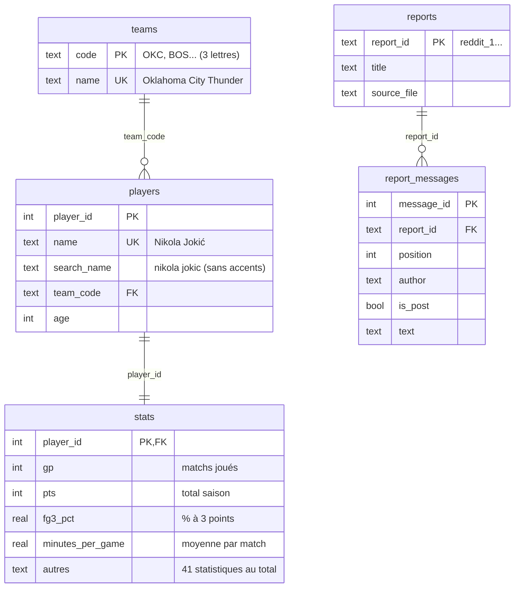

# Base de données SportSee (SQLite)

Base relationnelle alimentée par `load_excel_to_db.py`, interrogée par l'outil LangChain
`sql_tool.py`. Fichier : `data/database/sportsee.db` (non versionné, recréé à chaque
ingestion à partir des fichiers sources).

```bash
poetry run python -m sportsee_llm_eval.sql.load_excel_to_db
```

## Schéma



| Table | Lignes | Contenu | Clés |
|---|---|---|---|
| `teams` | 30 | Code et nom complet des équipes | PK `code` ; `name` unique |
| `players` | 569 | Un joueur, son équipe, son âge | PK `player_id` ; FK `team_code` → `teams.code` ; `name` unique |
| `stats` | 569 | Statistiques de saison régulière d'un joueur | PK et FK `player_id` → `players` (relation 1-1) |
| `reports` | 4 | Rapports textuels : threads Reddit r/nba | PK `report_id` |
| `report_messages` | 355 | Post initial et commentaires, nettoyés de l'OCR | PK `message_id` ; FK `report_id` → `reports` |

Contraintes vérifiées par SQLite : clés étrangères activées, `w + l = gp`, réussis ≤ tentés
(`fgm ≤ fga`, `fg3m ≤ fg3a`, `ftm ≤ fta`), âge entre 15 et 50. Les mêmes règles (et les
bornes de chaque statistique) sont d'abord vérifiées par le modèle Pydantic
`PlayerSeasonStats` à l'ingestion.

### Colonnes de `stats`

Les statistiques de comptage sont des **totaux de saison** ; `minutes_per_game` et
`plus_minus` sont des **moyennes par match**. Pour une moyenne par match d'un total :
`1.0 * pts / gp`.

| Colonne | Excel | Colonne | Excel | Colonne | Excel |
|---|---|---|---|---|---|
| `gp` | GP | `oreb` | OREB | `off_rtg` | OFFRTG |
| `w`, `l` | W, L | `dreb` | DREB | `def_rtg` | DEFRTG |
| `minutes_per_game` | Min | `reb` | REB | `net_rtg` | NETRTG |
| `pts` | PTS | `ast` | AST | `ast_pct` | AST% |
| `fgm`, `fga` | FGM, FGA | `tov` | TOV | `ast_to` | AST/TO |
| `fg_pct` | FG% | `stl` | STL | `ast_ratio` | AST RATIO |
| `fg3m`, `fg3a` | 3PM, 3PA | `blk` | BLK | `oreb_pct`, `dreb_pct`, `reb_pct` | OREB%, DREB%, REB% |
| `fg3_pct` | 3P% | `pf` | PF | `to_ratio` | TO RATIO |
| `ftm`, `fta` | FTM, FTA | `fp` | FP | `efg_pct`, `ts_pct`, `usg_pct` | EFG%, TS%, USG% |
| `ft_pct` | FT% | `dd2`, `td3` | DD2, TD3 | `pace`, `pie`, `poss` | PACE, PIE, POSS |
| | | `plus_minus` | +/- | | |

Les noms SQL évitent les caractères spéciaux des en-têtes Excel (`3P%`, `+/-`) : le LLM n'a
pas à générer de guillemets, source fréquente d'erreurs. La correspondance complète est dans
`COLUMN_LABELS` (`sql/schema.py`) et les descriptions dans le dictionnaire des données
corrigé, fourni au LLM comme glossaire.

### Choix de modélisation

- **Pas de table `matches`.** La consigne demandait les tables `players`, `matches`, `stats`
  et `reports`, mais les données fournies ne contiennent que des totaux de saison, sans
  résultat ni statistique par match. Le mentor a confirmé une erreur dans la consigne. Une
  table vide aurait laissé croire au LLM qu'il pouvait répondre à des questions par match.
- **`stats` séparée de `players`** : l'identité du joueur d'un côté, ses performances de
  l'autre. Avec plusieurs saisons, `stats` recevrait une colonne `season` et une clé
  `(player_id, season)` sans toucher à `players`.
- **`search_name`** : le nom en minuscules et sans accents. Les questions écrivent souvent
  « jokic » ou « doncic » : un `LIKE '%Jokic%'` ne trouve pas « Jokić ». Calculé à
  l'ingestion, il rend la recherche déterministe au lieu de compter sur le LLM.
- **`reports` / `report_messages`** : les threads Reddit, déjà indexés pour la recherche
  documentaire, sont aussi disponibles en SQL (comptages, recherche de mentions).
- **Un joueur, une équipe** : la source n'attribue qu'une équipe par joueur, même après un
  transfert. Les totaux par équipe sont donc des sommes des joueurs, pas les statistiques
  officielles d'équipe.

## Sécurité de l'outil SQL

1. Le LLM ne génère qu'une requête, contrôlée avant exécution : une seule instruction,
   `SELECT` ou `WITH` uniquement, aucun mot-clé d'écriture (`INSERT`, `DELETE`, `DROP`,
   `PRAGMA`, `ATTACH`...).
2. La base est ouverte en **lecture seule** (`mode=ro`) : une écriture qui passerait le
   contrôle serait refusée par SQLite.
3. Le résultat est limité à 25 lignes.
4. En cas d'erreur SQL, une seule nouvelle génération est tentée avec le message d'erreur.

## Exemples de requêtes types

**Classement simple**, les meilleurs passeurs :

```sql
SELECT p.name, p.team_code, s.ast
FROM stats s JOIN players p ON p.player_id = s.player_id
ORDER BY s.ast DESC LIMIT 5;
```

**Filtre avec seuil** : un pourcentage n'a de sens qu'avec un volume minimal de tentatives.

```sql
SELECT p.name, s.ft_pct, s.ftm, s.fta
FROM stats s JOIN players p ON p.player_id = s.player_id
WHERE s.fta >= 200
ORDER BY s.ft_pct DESC LIMIT 5;
```

**Agrégation multicritère** : jeunes joueurs réguliers et efficaces, classés par points par match.

```sql
SELECT p.name, t.name AS equipe, p.age, s.gp,
       ROUND(1.0 * s.pts / s.gp, 1) AS pts_par_match, s.ts_pct
FROM stats s
JOIN players p ON p.player_id = s.player_id
JOIN teams t ON t.code = p.team_code
WHERE p.age <= 25 AND s.gp >= 60 AND s.ts_pct >= 60
ORDER BY pts_par_match DESC LIMIT 5;
-- Tyler Herro (Miami Heat) 23,9 ; Darius Garland 20,6 ; Coby White 20,4 ...
```

**Agrégation par équipe** :

```sql
SELECT t.name, COUNT(*) AS joueurs, SUM(s.reb) AS rebonds, ROUND(AVG(p.age), 1) AS age_moyen
FROM stats s
JOIN players p ON p.player_id = s.player_id
JOIN teams t ON t.code = p.team_code
GROUP BY t.code ORDER BY rebonds DESC LIMIT 3;
-- Houston Rockets 4067 ; Sacramento Kings 3977 ; Milwaukee Bucks 3875
```

**Part d'un joueur dans le total de son équipe** (fonction de fenêtre) :

```sql
SELECT p.name, s.pts,
       ROUND(100.0 * s.pts / SUM(s.pts) OVER (PARTITION BY p.team_code), 1) AS part_pct
FROM stats s JOIN players p ON p.player_id = s.player_id
WHERE p.team_code = 'OKC'
ORDER BY s.pts DESC LIMIT 3;
-- Shai Gilgeous-Alexander 25,2 % des points de l'effectif
```

**Comparaison de joueurs, moyenne par match** :

```sql
SELECT p.name, s.pts, s.gp, ROUND(1.0 * s.pts / s.gp, 1) AS pts_par_match
FROM stats s JOIN players p ON p.player_id = s.player_id
WHERE p.search_name LIKE '%booker%' OR p.search_name LIKE '%durant%';
```

**Rapports textuels** : mentions d'un joueur dans les threads.

```sql
SELECT r.title, COUNT(*) AS messages, SUM(m.text LIKE '%Randle%') AS mentions_randle
FROM report_messages m JOIN reports r USING (report_id)
GROUP BY r.report_id ORDER BY mentions_randle DESC;
```

**Comparaison domicile / extérieur** : impossible avec ces données. Il faudrait une table
`matches` (date, équipe à domicile, équipe à l'extérieur, scores) et une table de
statistiques par joueur et par match, avec la clé `(match_id, player_id)` :

```sql
-- schéma nécessaire, non disponible dans les données fournies
SELECT CASE WHEN m.home_team = p.team_code THEN 'domicile' ELSE 'extérieur' END AS lieu,
       ROUND(AVG(pg.reb), 1) AS rebonds_moyens
FROM player_game_stats pg
JOIN matches m ON m.match_id = pg.match_id
JOIN players p ON p.player_id = pg.player_id
WHERE p.team_code = 'BOS'
GROUP BY lieu;
```

L'outil SQL répond `donnees_indisponibles` à ce type de question, et l'agent déclare
l'information indisponible au lieu de l'inventer.
