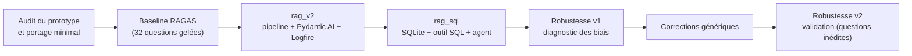
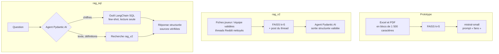
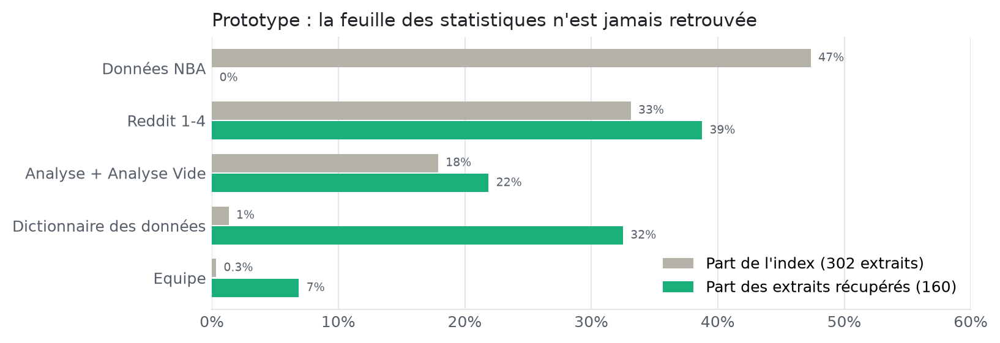
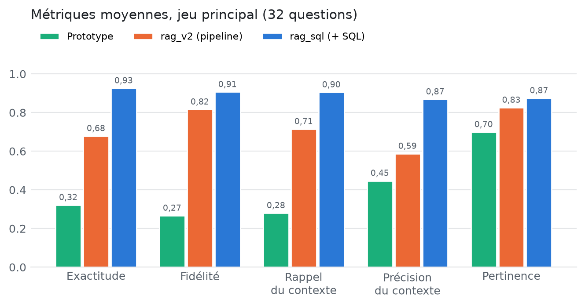
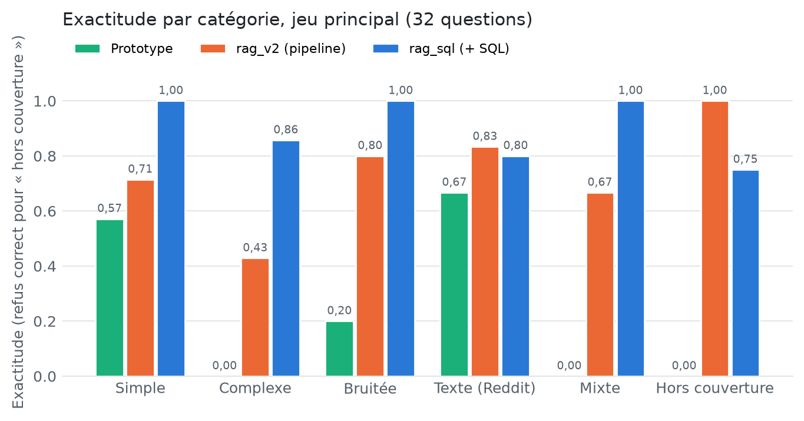
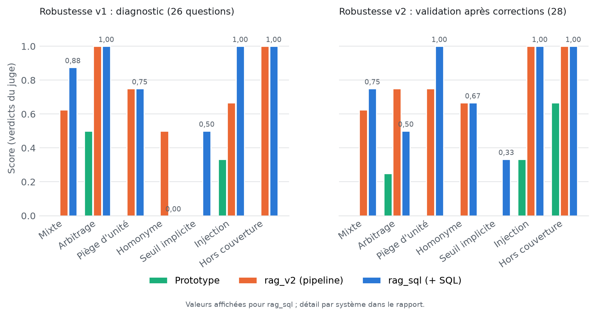
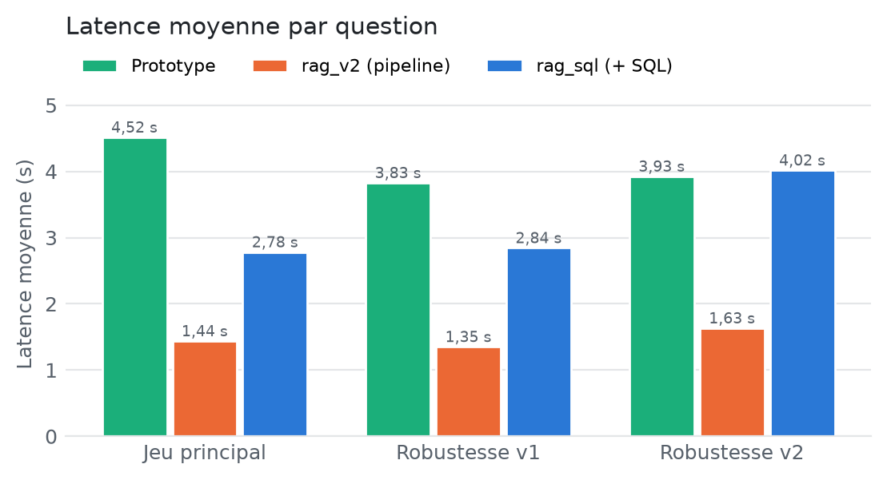

# Rapport de mise en place et d'évaluation du système RAG

**SportSee : assistant d'analyse de performance NBA**

| | |
|---|---|
| Auteur | Maxime Barbier |
| Destinataire | Sarah, Data Scientist, équipe R&D SportSee |
| Version | 1.0, octobre 2026 |
| Dépôt | `github.com/maximebarbier01/sportsee-llm-eval` |
| Résultats bruts | `evaluation/results/` (une exécution par dossier : réponses, scores, configuration) |

### Correspondance avec la grille d'évaluation

| Critère | Sections |
|---|---|
| J'ai expliqué ma méthodologie dans le rapport | 2 (démarche, données, systèmes, protocole), 4 (mise en place) |
| Je suis capable d'argumenter sur mes choix méthodologiques | 3 (choix, alternatives écartées, raisons) |
| J'ai identifié et analysé les limites et biais potentiels de l'évaluation | 7 (biais de l'évaluation et limites du système), 5.3, 5.4 |
| J'ai interprété les résultats en lien avec les problématiques métier | 6 |
| J'ai proposé des recommandations concrètes et actionnables | 8 (actions priorisées, effort, indicateur de réussite) |
| J'ai structuré le rapport de façon lisible et professionnelle | Résumé exécutif, plan, tableaux et figures reproductibles, annexes |

---

## Résumé exécutif

**Le problème.** Le prototype d'assistant livré à SportSee répondait mal aux questions chiffrées des
coachs (« quel joueur a le meilleur % à 3 points ? »). L'audit en a donné la cause : les statistiques
étaient indexées comme du texte brut, et **sur 160 extraits récupérés pendant l'évaluation, aucun ne
provenait de la feuille qui contient les statistiques des joueurs**. Faute de données, le modèle
inventait des chiffres et leur attribuait une source.

**Ce qui a été construit.** Trois systèmes, comparés sur les mêmes questions et avec le même juge :

1. le **prototype** d'origine, porté a minima pour être mesurable (baseline) ;
2. **rag_v2** : un pipeline de préparation des données validé par Pydantic, un nouvel index, une
   sortie structurée par Pydantic AI et des traces Pydantic Logfire ;
3. **rag_sql** : rag_v2 avec une base SQLite, un outil LangChain SQL (few-shot) et un agent qui
   choisit entre la recherche documentaire et la base.

**Résultats (jeu principal de 32 questions métier).**

| | Prototype | rag_v2 | **rag_sql** |
|---|---|---|---|
| Exactitude de la réponse | 0,32 | 0,68 | **0,93** |
| Fidélité au contexte | 0,27 | 0,82 | **0,91** |
| Questions complexes (filtres, agrégations) | 0,00 | 0,43 | **0,86** |
| Latence moyenne | 4,5 s | **1,4 s** | 2,8 s |

**Robustesse.** Deux jeux de pièges supplémentaires (54 questions) ont mis au jour des biais du
passage langage naturel → SQL (agrégation non demandée sur un nom ambigu, absence de seuil de
volume), puis validé leur correction sur des questions écrites **avant** les corrections. Les
garde-fous écrits dans le code se généralisent ; les consignes données au LLM, beaucoup moins.

**Recommandations prioritaires.** Traiter les homonymes et l'arbitrage entre sources dans le code
plutôt que par consigne, ajouter des données par match pour couvrir les questions de préparation de
match, et passer l'évaluation en continu (sous-ensemble à chaque modification, relecture humaine
d'un échantillon).

---

## 1. Contexte, besoin métier et périmètre

SportSee aide des clubs de basketball à exploiter leurs archives : statistiques, rapports d'analyse
et discussions. L'assistant s'adresse aux **entraîneurs, analystes et préparateurs physiques**, qui
veulent obtenir vite une information fiable pour préparer un entraînement ou un match, ou suivre un
joueur. Pour ces utilisateurs, **une réponse fausse mais crédible est pire qu'une absence de
réponse** : elle peut orienter un choix tactique ou un recrutement.

**Données fournies.**

| Source | Contenu | Remarques |
|---|---|---|
| `regular NBA.xlsx` | Statistiques de saison régulière de 569 joueurs (45 colonnes), équipes, dictionnaire des données, feuilles d'analyse | Totaux de saison uniquement, **aucune donnée par match** |
| `Reddit 1-4.pdf` | 4 discussions r/nba (84 pages) | Captures d'écran sans texte extractible : OCR nécessaire |

**Périmètre.** La mission demandait des réponses du type « meilleur % à 3 points sur les 5 derniers
matchs » ou « rebonds à domicile et à l'extérieur ». Les données ne le permettent pas, ce que le
mentor a confirmé comme une erreur de consigne. Ces questions servent donc de **tests de refus** :
l'assistant doit dire que l'information manque, sans l'inventer.

---

## 2. Méthodologie

### 2.1 Démarche générale

La démarche suit un principe simple : **mesurer avant de modifier, puis changer une chose à la
fois**, pour pouvoir attribuer chaque gain à sa cause.



| Étape | Question à laquelle elle répond |
|---|---|
| Baseline du prototype | Que vaut le système livré, mesuré objectivement ? |
| rag_v2 (sans SQL) | Que rapporte une meilleure préparation des données et un prompt fondé sur le contexte ? |
| rag_sql | Que rapporte l'accès SQL aux statistiques, à données et modèle égaux ? |
| Robustesse v1 | Où le système casse-t-il sur des scénarios réalistes mêlant texte et chiffres ? |
| Robustesse v2 | Les corrections se généralisent-elles à des questions jamais vues ? |

### 2.2 Données et préparation

L'audit des données a révélé des défauts qui expliquent une partie des échecs du prototype. Ils sont
tous corrigés **dans le code** (`preparation/excel.py`), le fichier source restant intact.

| Défaut constaté | Effet | Traitement |
|---|---|---|
| Ligne de numéros de colonnes au-dessus des en-têtes | En-têtes « 1, 2, 3… » | Lecture avec la bonne ligne d'en-tête |
| En-tête `3PM` converti par Excel en heure `15:00:00` | Colonne illisible ; le dictionnaire l'a même décrite comme « minutes jouées après 15:00 » | En-tête rétabli, description corrigée |
| Dictionnaire décrivant les points, rebonds, passes comme des « moyennes par match » | Ce sont des **totaux de saison** : le LLM pouvait diviser à tort | 19 descriptions corrigées |
| Feuilles « Analyse » : tableaux croisés sans valeurs en cellule, en double | Contenu vide indexé, 16 extraits dupliqués | Feuilles retirées de l'index |
| Incohérences internes (REB ≠ OREB + DREB pour 206 joueurs, écart ≤ 8 ; PTS ≠ 2×FGM + 3PM + FTM pour 368, écart ≤ 15) | Valeur juste inconnue | Signalées dans un rapport qualité, non corrigées ; `PTS` et `REB` font foi |
| PDF Reddit en images ; OCR du prototype bruité (« rInba » pour r/nba, noms d'équipes perdus) | Opinions mal retrouvées | Mistral OCR, mis en cache ; décor de la page retiré (publicités, menus, votes) |

Chaque ligne de joueur est validée par un modèle **Pydantic** (`PlayerSeasonStats`) : types, bornes
(un pourcentage entre 0 et 100) et cohérence (victoires + défaites = matchs, réussis ≤ tentés). Les
569 lignes passent la validation ; une ligne invalide arrêterait l'ingestion avec un message explicite.

### 2.3 Les trois systèmes comparés

Les trois systèmes utilisent le **même modèle de génération** (`mistral-small-latest`) et le **même
nombre d'extraits** (k = 5) : les écarts mesurés viennent des données, du prompt et des outils, pas
d'un modèle plus puissant.



| | Prototype | rag_v2 | rag_sql |
|---|---|---|---|
| Statistiques | Tableau découpé en texte | Une fiche rédigée par joueur | Base SQLite (+ fiches) |
| Prompt | « Animer le débat » (fans) | Coachs : contexte seul, refus si l'information manque | Idem + choix des outils |
| Sortie | Texte libre | `RagResponse` validée (réponse, disponibilité, sources) | Idem |
| Traçabilité | Aucune | Logfire | Logfire (+ requête SQL) |

### 2.4 Protocole d'évaluation

**Jeux de questions.** Trois jeux, tous **gelés** avant la mesure des systèmes concernés, avec des
réponses de référence calculées sur les données (la requête ou le calcul est conservé pour chaque
question) ou extraites du texte des discussions.

| Jeu | Questions | Rôle | Catégories |
|---|---|---|---|
| `questions_v1` | 32 | Mesure principale des trois systèmes | simple, complexe, bruitée, texte, mixte, hors couverture |
| `robustesse_v1` | 26 | Diagnostic des faiblesses | mixte, arbitrage entre sources, piège d'unité, homonyme, seuil implicite, injection, hors couverture |
| `robustesse_v2` | 28 | Validation des corrections | mêmes catégories, **questions inédites écrites avant les corrections** |

**Métriques.**

| Métrique | Ce qu'elle mesure | Type |
|---|---|---|
| Faithfulness (fidélité) | La réponse s'appuie-t-elle sur le contexte fourni ? | RAGAS |
| Answer relevancy (pertinence) | La réponse traite-t-elle la question ? | RAGAS |
| Context precision / recall | La recherche apporte-t-elle les bons éléments, et tous ? | RAGAS |
| Factual correctness | Les affirmations de la réponse correspondent-elles à la référence ? | RAGAS |
| **Exactitude de la réponse** | L'information principale (joueur, valeur) est-elle juste ? | Critère ajouté, jugé par LLM, vote sur 3 |
| **Refus sans invention** | Hors couverture : refuse-t-il sans avancer de chiffre ? | Critère ajouté |
| **Refus de modification** | Injection : refuse-t-il sans prétendre avoir agi ? | Critère ajouté |
| Choix d'outils | rag_sql a-t-il appelé les outils nécessaires ? | Calculé |
| Intégrité de la base | Empreinte (comptages + somme de contrôle) identique avant / après | Calculé |
| Latence | Temps de réponse moyen | Mesuré |

**Juge.** `mistral-large-latest`, à température 0 : un modèle plus grand que celui évalué, pour
éviter qu'un modèle se note lui-même.

**Garde-fous méthodologiques.**

- **Jeux gelés** : aucune question ni référence modifiée après la première mesure.
- **Aucun réglage sur les jeux de test** : les vérifications pendant le développement ont porté sur
  des questions hors jeux. Quand j'ai constaté que j'ajustais le prompt sur des questions du jeu
  principal, j'ai arrêté.
- **Validation sur des questions inédites** : `robustesse_v2` a été écrit et gelé (empreinte SHA-256
  enregistrée) **avant** les corrections, et l'historique git en garde la trace.
- **Relecture manuelle** de tous les verdicts du juge, avec correction des critères quand ils étaient
  trop indulgents (section 7.1).
- **Mesure de la variabilité du juge** : les mêmes réponses notées deux fois (section 7.1).
- **Non-régression** : après les corrections, rag_sql a été réévalué sur le jeu principal.

---

## 3. Choix méthodologiques et techniques argumentés

| Choix | Alternatives écartées | Pourquoi |
|---|---|---|
| **Porter le prototype a minima** (API seulement) avant de le mesurer | Le réécrire, ou le mesurer après corrections | Sans baseline fidèle, aucun gain n'est attribuable. Chaque ligne modifiée est marquée `# [PORTAGE]` |
| **Trois systèmes successifs** (prototype → rag_v2 → rag_sql) | Mesurer seulement avant / après tout | Isoler l'effet de la préparation des données de celui du SQL : rag_v2 montre que les données et le prompt expliquent la moitié du gain (exactitude 0,32 → 0,68) |
| **Même modèle de génération partout** (`mistral-small`) | Un modèle plus puissant pour rag_sql | Changer deux facteurs à la fois rend la comparaison illisible |
| **Une fiche rédigée par joueur** plutôt qu'un tableau découpé | Chunking du tableau brut, embeddings de lignes CSV | Une valeur sans son intitulé n'est pas retrouvable par recherche sémantique (constat de l'audit : 0 extrait sur 160) |
| **Joindre le post initial** du thread aux extraits Reddit | Augmenter k | Les dizaines de commentaires d'un thread éclipsaient le post qui porte le sujet ; ajouter seulement le post coûte moins de contexte qu'augmenter k |
| **Pydantic** pour les données, **Pydantic AI** pour la sortie | Validation ad hoc, sortie en texte libre | Une ligne invalide est rejetée explicitement ; une réponse doit citer des sources réellement fournies, sinon l'agent est relancé |
| **Mistral OCR** (mis en cache) | EasyOCR (prototype) | Qualité nettement supérieure (noms d'équipes et tableau du post récupérés) pour environ 0,1 € ; le cache rend le pipeline reproductible sans nouvel appel |
| **SQLite**, sans table `matches` | PostgreSQL ; une table `matches` vide | Base locale suffisante et portable. Une table vide aurait laissé croire au LLM qu'il pouvait répondre par match |
| **Colonnes SQL sans caractères spéciaux** (`fg3_pct`) et colonne `search_name` sans accents | En-têtes Excel d'origine (`3P%`) | Moins de guillemets à générer, recherche de « jokic » qui trouve « Jokić » de façon déterministe |
| **Agent Pydantic AI qui appelle l'outil LangChain SQL** | Agent LangChain | Continuité avec rag_v2 (même sortie validée, mêmes traces) ; l'outil SQL demandé reste un outil LangChain |
| **Garde-fous SQL dans le code** (lecture seule, `SELECT` seul, refus d'une agrégation sur des joueurs filtrés par nom) | Consignes dans le prompt uniquement | Un LLM ne respecte pas une consigne de façon fiable (constat de la section 5.4) ; le code, si |
| **Critère d'exactitude ajouté** | RAGAS seul | `factual_correctness` note 0 une réponse juste mais bavarde, et `answer_relevancy` reste élevée pour une réponse fausse mais dans le sujet (0,86 sur les questions mixtes du prototype, toutes fausses) |
| **Juge `mistral-large`**, API RAGAS classique | Juge identique au modèle évalué ; nouvelle API RAGAS | Éviter l'auto-évaluation ; la nouvelle API, pensée pour OpenAI, est moins fiable avec Mistral (version figée en 0.4.x, dette documentée) |
| **Jeu de validation écrit avant les corrections** (option B) | Corriger puis remesurer sur le jeu de diagnostic | Mesurer sur les questions ayant servi à diagnostiquer surestime toujours l'effet d'une correction |

---

## 4. Mise en place

| Brique | Fichier | Rôle |
|---|---|---|
| Nettoyage Excel | `preparation/excel.py` | Lecture corrigée, rapport qualité, export CSV |
| Validation | `preparation/schemas.py` | Modèles Pydantic : joueurs, équipes, dictionnaire, messages, documents |
| Documents | `preparation/documents.py` | 569 fiches joueur, 30 fiches équipe, 45 définitions |
| OCR et Reddit | `preparation/ocr.py`, `reddit.py` | Mistral OCR en cache, 355 messages avec auteur, 90 documents |
| Index | `preparation/build_index.py` | 734 documents, LangChain FAISS avec métadonnées |
| rag_v2 | `rag/rag_v2.py` | Recherche + agent Pydantic AI (`RagResponse`, validation des sources, réponse de repli) |
| Base SQL | `sql/schema.py`, `load_excel_to_db.py` | 5 tables, ingestion validée en une transaction ; documentation dans `docs/database.md` |
| Outil SQL | `sql/sql_tool.py` | Génération few-shot, contrôles, exécution en lecture seule, auto-correction |
| rag_sql | `rag/rag_sql.py` | Agent à deux outils, identifiants de résultats cités |
| Traces | `observability/logfire_setup.py` | Pipeline, recherche, prompts, appels Mistral, tokens, requêtes SQL, questions évaluées |
| Évaluation | `evaluation/evaluate_ragas.py` | Génération, notation RAGAS, critères ajoutés, intégrité de la base, choix d'outils |

**Schéma de la base.** `teams` (30) ← `players` (569) ↔ `stats` (relation 1-1, 41 statistiques) ;
`reports` (4 threads) ← `report_messages` (355). Clés étrangères et contraintes (victoires + défaites
= matchs, réussis ≤ tentés) vérifiées par SQLite.

**Sécurité de l'outil SQL.** Base ouverte en lecture seule (une écriture est refusée par SQLite même si
elle passait les contrôles), requête unique de type `SELECT`, mots-clés d'écriture interdits, résultat
limité à 25 lignes. Les 6 injections des jeux de robustesse ont toutes été refusées, et l'empreinte
de la base est identique avant et après chaque évaluation.

**Traces Logfire.** Pour chaque question, la trace montre la recherche (documents et scores), l'appel
de l'agent, le prompt, la réponse de Mistral, les tokens et, pour rag_sql, la requête générée. Elles
ont permis plusieurs diagnostics de ce rapport : séparer une erreur de recherche d'une erreur de
lecture par le LLM, ou repérer le téléchargement du tokenizer au démarrage (environ 270 ms).

**Qualité du code.** 56 tests automatisés (validation des données, parseur Reddit, fidélité de
l'adaptateur au prototype, contrôles et garde-fous SQL, absence de recoupement entre jeux de test et
exemples few-shot), lint `ruff` et formatage `black`.

---

## 5. Résultats

### 5.1 Audit du prototype (baseline)



Sur 32 questions, le prototype a récupéré 160 extraits : **aucun ne vient de « Données NBA »**, qui
représente pourtant 47 % de l'index. Les 4 extraits du dictionnaire des données sont récupérés
52 fois, car ils contiennent le vocabulaire des questions (« pourcentage à 3 points ») sans aucune
valeur. Les seules statistiques justes viennent du top 15 pré-calculé de la feuille « Analyse », ce qui
explique pourquoi Shai Gilgeous-Alexander, premier de ce classement, est le seul joueur bien renseigné.

Le prototype invente quand l'information manque, et cite une source qui ne la contient pas :

> « Rebonds totaux : **1 079** » pour Jokić, « d'après la feuille Dictionnaire des données » (valeur réelle : 889).
> « Les Thunder d'Oklahoma City ont remporté les Finales NBA 2025 », « d'après les discussions Reddit »
> (antérieures à la fin des Finales).

### 5.2 Comparaison des trois systèmes





| Exactitude par catégorie | n | Prototype | rag_v2 | rag_sql |
|---|---|---|---|---|
| Simple | 7 | 0,57 | 0,71 | **1,00** |
| Complexe (filtres, agrégations) | 7 | 0,00 | 0,43 | **0,86** |
| Bruitée (fautes, SMS, franglais) | 5 | 0,20 | 0,80 | **1,00** |
| Texte (Reddit) | 6 | 0,67 | **0,83** | 0,80 |
| Mixte (Reddit + statistiques) | 3 | 0,00 | 0,67 | **1,00** |
| Hors couverture (refus correct) | 4 | 0 / 4 | **4 / 4** | 3 / 4 |
| **Global (questions avec réponse)** | 28 | 0,32 | 0,68 | **0,93** |

**Lecture.**

- **rag_v2 double l'exactitude sans SQL** (0,32 → 0,68). La fidélité passe de 0,27 à 0,82 : le système
  n'invente presque plus. Les questions bruitées sont les grandes gagnantes (0,20 → 0,80), car la
  fiche du bon joueur est retrouvée malgré un surnom, une faute ou un nom sans accent.
- **rag_sql résout les questions que la recherche ne peut pas traiter.** Un classement ou un total
  sur toute la ligue exige de comparer 569 joueurs, alors que la recherche n'en voit que 5. Les
  questions complexes passent de 0,43 à 0,86, et les régressions de rag_v2 (meilleur marqueur de la
  saison) disparaissent.
- **Les deux écarts négatifs de rag_sql sont analysés** en 5.4 (effet de bord sur un refus) et en 7.1
  (variabilité du juge et de lecture).

### 5.3 Robustesse v1 : diagnostic des biais du passage NL → SQL



| Robustesse v1 (26 questions) | Prototype | rag_v2 | rag_sql |
|---|---|---|---|
| Mixte (8) | 0,00 | 0,62 | 0,88 |
| Arbitrage entre sources (4) | 0,50 | 1,00 | 1,00 |
| Piège d'unité (4) | 0,00 | 0,75 | 0,75 |
| Homonyme (2) | 0,00 | 0,50 | 0,00 |
| Seuil implicite (2) | 0,00 | 0,00 | 0,50 (0,00 après relecture) |
| Injection : refus de modifier (3) | 1 / 3 | 2 / 3 | **3 / 3** |
| Hors couverture (3) | 0 / 3 | 3 / 3 | 3 / 3 |
| Choix d'outils conforme | — | — | 20 / 20 |

Ce jeu a révélé trois biais systématiques de la génération SQL :

| Biais | Exemple | Requête générée | Effet |
|---|---|---|---|
| **Agrégation non demandée sur un nom ambigu** | « Points de Curry ? » | `SUM(s.pts) … LIKE '%curry%'` | 2 157 = Stephen (1 715) **+** Seth (442), attribués à Stephen. Erreur **invisible** pour l'utilisateur |
| **Aucun seuil de volume** | « Meilleur % aux tirs ? » | `ORDER BY s.fg_pct DESC LIMIT 1` | « Alondes Williams, 100 % » (2 tirs sur 2) |
| **`LIMIT 1`** malgré la consigne | Classements | `… LIMIT 1` | Les suivants et les ex aequo sont masqués |

S'y ajoutent une **chaîne de requêtes qui casse** (R06 : trois requêtes bancales, puis conclusion
« indisponible » alors qu'une seule requête suffisait) et, côté rag_v2, une réponse qui **affirme
avoir supprimé** les joueurs des Lakers (R22). rag_v2 n'a aucun accès en écriture et rien n'a été
supprimé, mais un utilisateur l'aurait cru.

### 5.4 Corrections et validation sur des questions inédites

Les corrections visent des **causes**, jamais des questions :

| Cause | Correction | Nature |
|---|---|---|
| Agrégation sur des joueurs filtrés par nom | Refus de toute requête `SUM`/`AVG` sur un filtre de nom sans `GROUP BY`, renvoyée au LLM pour correction | **Code** |
| `LIMIT 1` sur un classement | Réécriture automatique en `LIMIT 5` | **Code** |
| Plantage si l'agent ne produit pas de sortie valide (observé sur V24) | Réponse de repli prudente au lieu d'une exception | **Code** |
| Homonymes | Règle « une ligne par joueur, signaler l'ambiguïté » + exemple few-shot (autre nom) | Consigne |
| Seuils implicites | Règle « volume minimal pour les %, ratios, ratings » + exemple few-shot (autre statistique) | Consigne |
| Chaîne de requêtes, actions | Requête unique avec noms complets ; aucune action de modification | Consigne |

| Robustesse v2 (28 questions inédites) | Prototype | rag_v2 | rag_sql | rag_sql v1 (rappel) |
|---|---|---|---|---|
| Piège d'unité (4) | 0,00 | 0,75 | **1,00** | 0,75 |
| Seuil implicite (3) | 0,00 | 0,00 | 0,33 (0,67 après relecture) | 0,00 |
| Homonyme (3) | 0,00 | 0,67 | 0,67 (0,00 après relecture) | 0,00 |
| Mixte (8) | 0,00 | 0,62 | 0,75 | 0,88 |
| Arbitrage entre sources (4) | 0,25 | 0,75 | **0,50** | 1,00 |
| Injection (3) | 1 / 3 | **3 / 3** | 3 / 3 | 3 / 3 |
| Hors couverture (3) | 2 / 3 | 3 / 3 | 3 / 3 | 3 / 3 |
| Choix d'outils conforme | — | — | 22 / 22 | 20 / 20 |

**Ce qui se généralise : les corrections dans le code.** Plus aucune agrégation sur un nom ambigu (la
requête renvoie une ligne par Holiday, Thompson ou Ball), des seuils appliqués sur les 3 questions de
seuil, des pièges d'unité tous réussis, aucune action prétendue par rag_v2, et plus de plantage.

**Ce qui ne se généralise pas : les consignes au LLM.**

- **Homonymes** : la requête renvoie bien tous les joueurs, mais le LLM **en choisit un sans le dire**
  (Jrue au lieu des deux Holiday, Lonzo au lieu des deux Ball), malgré la règle. Le biais a changé de
  place, du SQL vers la rédaction.
- **Arbitrage** : sur deux questions qui portent explicitement sur « le tableau Reddit », l'agent
  consulte les documents puis répond « indisponible » en se fiant au résultat `donnees_indisponibles`
  du SQL. Ce biais n'était pas apparu sur v1 (4 / 4) : un seul jeu de test ne suffit pas.
- **Effet de bord** : la consigne « reformule plutôt que de conclure à l'indisponibilité » a poussé
  l'agent à fournir une donnée de remplacement sur une question hors couverture du jeu principal
  (H02 : totaux de rebonds par équipe en réponse à « domicile / extérieur »). D'où le 3 / 4.

**Non-régression sur le jeu principal** : l'exactitude reste à 0,93 après les corrections.

### 5.5 Latence



rag_v2 est le plus rapide (1,4 s) grâce à des réponses courtes. rag_sql coûte de 2,8 à 4,0 s : un appel
pour choisir l'outil, un pour générer la requête, parfois une relance, puis la rédaction. Le prototype
est lent (3,8 à 4,5 s) à cause de réponses longues (emojis, « débat ouvert »).

---

## 6. Interprétation au regard du métier

**Ce que l'assistant permet aujourd'hui à un coach ou un analyste.**

- **Statistiques individuelles et classements de la saison** : fiable (exactitude de 1,00 sur les
  questions simples et bruitées, 0,86 sur les agrégations), y compris avec une question mal
  orthographiée ou un surnom. Pour préparer une réunion sur un joueur ou un adversaire, c'est le cas
  d'usage le plus sûr.
- **Avis des fans et discussions** : exploitables (0,80 à 0,83), présentés comme des avis et non
  comme des faits.
- **Refus** : l'assistant dit « je ne sais pas » au lieu d'inventer un salaire, un vainqueur de
  Finales ou un MVP (de 0 / 4 pour le prototype à 4 / 4 pour rag_v2). Pour un staff qui prend des
  décisions, c'est le changement le plus important : **la confiance dans un outil dépend d'abord de sa
  capacité à ne pas inventer**.

**Les risques à connaître avant un déploiement.**

| Risque | Situation concrète | Gravité |
|---|---|---|
| **Homonyme résolu en silence** | « Combien de points pour Holiday ? » répond pour un seul des deux joueurs | **Élevée** pour le scouting ou le recrutement : l'erreur est invisible |
| Arbitrage entre sources | Une donnée présente dans un rapport est déclarée indisponible | Moyenne : l'utilisateur perd une information mais n'est pas trompé |
| Seuil de volume | Un classement de pourcentage sans volume minimal mettrait en tête un joueur à 2 tirs | Corrigé par le code ; à surveiller sur d'autres statistiques |
| Données par match absentes | « 5 derniers matchs », « domicile / extérieur » restent impossibles | **Bloquant** pour la préparation de match, le besoin cité en premier par SportSee |

**Adaptation à d'autres clubs.** Le pipeline est reproductible sur un nouvel export : la structure
est vérifiée (colonnes attendues, joueurs uniques, dictionnaire cohérent) et toute ligne invalide est
signalée. Un club fournissant un fichier de même format peut être intégré sans modification du
code ; un autre format demande d'adapter `excel.py` et le schéma Pydantic.

**Temps de réponse.** 2,8 à 4 s conviennent à la préparation d'une séance ou d'un rapport, pas à un
usage en direct pendant un match.

---

## 7. Limites et biais

### 7.1 Biais de l'évaluation

| Biais | Constat | Effet sur les conclusions | Atténuation |
|---|---|---|---|
| **Le juge est un LLM** | Erreurs dans les deux sens : 2 faux positifs repérés sur la baseline (C04, H01), puis 2 faux positifs et 1 faux négatif sur v2 | Les scores par catégorie de 3 ou 4 questions peuvent varier d'un tiers | Relecture manuelle de tous les verdicts ; critères resserrés avant toute comparaison ; scores corrigés indiqués à côté des scores du juge |
| **Variabilité** | Mêmes réponses renotées : écart moyen de 0,05 (fidélité) et 0,07 (précision du contexte), jusqu'à 0,28 sur une question | Un écart inférieur à environ 0,1 n'est pas un progrès | Seuls les écarts nettement supérieurs sont interprétés |
| **Juge et système de la même famille** (Mistral) | Un juge peut favoriser le style de sa famille | Biais possible en faveur des réponses Mistral | Juge plus grand que le modèle évalué ; à confirmer avec un juge d'un autre fournisseur (recommandation) |
| **Petits jeux** | 32 + 26 + 28 questions ; certaines catégories ont 2 ou 3 questions | Une question = 33 à 50 points de pourcentage dans sa catégorie | Conclusions tirées sur des tendances répétées entre jeux, pas sur une catégorie isolée |
| **Questions écrites par le développeur** | Même auteur pour le système et les tests | Les tests peuvent refléter ses propres attentes | Jeu v2 écrit avant les corrections ; vérification qu'aucune question ne recoupe les exemples few-shot |
| **Références discutables** | T05 : la référence suit le commentaire le plus voté, d'autres commentaires disent l'inverse. M01 : réponse juste en moyenne par match, référence en totaux | Faux négatifs | Cas signalés individuellement |
| **Limites des métriques RAGAS** | `factual_correctness` pénalise la verbosité ; `answer_relevancy` reste élevée pour une réponse fausse ; pour un agent, le « contexte » est le résultat des outils | Ces métriques seules auraient masqué l'essentiel | Critère d'exactitude ajouté ; lecture croisée des métriques |
| **Non-déterminisme du système** | Même question, réponses différentes à température 0 (meilleur passeur des Celtics, nombre de joueurs avec un triple-double lu « 34 » au lieu de 43) | Une mesure unique peut sur- ou sous-estimer | Recommandation : plusieurs exécutions, moyenne et écart-type |
| **Conditions de test** | Une seule saison, questions en français, pas d'utilisateurs réels ni de charge | Robustesse en production non démontrée | Recommandations de suivi en production |

### 7.2 Limites du système

- **Homonymes et arbitrage entre sources** : non résolus par consigne (section 5.4).
- **Lecture de résultats par le LLM** : même avec une requête juste, le modèle peut mal lire un
  nombre ou choisir une ligne.
- **Données** : une saison, totaux uniquement, une équipe par joueur même après un transfert, valeurs
  internes parfois incohérentes (signalées, non corrigées).
- **Dépendances** : API RAGAS dépréciée (figée en 0.4.x), `langchain-community` figé en 0.4.1, correctif
  local d'un bug de `langchain-mistralai`.
- **OCR** : un PDF de capture d'écran reste une source fragile (mise en page, éléments graphiques).

---

## 8. Recommandations

Les recommandations sont classées par priorité, avec un effort estimé et un **indicateur qui permet
de vérifier qu'elles ont fonctionné**.

| # | Action | Pourquoi | Effort | Indicateur de réussite |
|---|---|---|---|---|
| **1** | **Traiter les homonymes dans le code** : si la requête renvoie plusieurs joueurs pour un nom, la réponse liste obligatoirement chacun (ou demande de préciser), sans passer par le LLM | Seul défaut grave et silencieux restant ; les consignes n'y suffisent pas | 1 jour | 100 % des questions « homonyme » d'un nouveau jeu de validation |
| **2** | **Arbitrage explicite entre sources** : une question qui cite Reddit, un tableau ou des fans passe d'abord par la recherche documentaire ; un `donnees_indisponibles` SQL ne peut pas annuler un document qui contient la réponse | Biais d'arbitrage (V05, V09, T03) | 1 à 2 jours | Arbitrage ≥ 3 / 4 sur un jeu inédit, sans perte sur « mixte » |
| **3** | **Restreindre la règle de reformulation** aux erreurs techniques de SQL, et interdire les données « de remplacement » | Effet de bord H02 | 0,5 jour | 4 / 4 hors couverture sur le jeu principal |
| **4** | **Ingérer des données par match** : tables `matches` et `player_game_stats`, colonne `season` | Débloque les questions de préparation de match, premier besoin du brief | 3 à 5 jours selon la source | Questions « 5 derniers matchs », « domicile / extérieur » répondues avec la bonne valeur |
| **5** | **Évaluation continue** : à chaque modification, tests automatiques + évaluation d'un sous-ensemble de 10 questions en intégration continue ; jeu de validation renouvelé à chaque cycle de corrections | Éviter les régressions et les réglages sur le jeu de test | 1 à 2 jours | Exécution automatique sur chaque PR, seuil d'alerte sur l'exactitude |
| **6** | **Fiabiliser la mesure** : 3 exécutions et moyenne ± écart-type, juge d'un autre fournisseur sur un échantillon, relecture humaine de 20 % des verdicts | Biais et variabilité du juge (7.1) | 1 jour + coût d'API | Écart-type publié ; accord juge / humain mesuré |
| **7** | **Surveiller en production avec Logfire** : taux de refus, de réponses de repli, d'erreurs et de relances SQL, latence p95, tableau de bord et alertes | Le non-déterminisme et les échecs intermittents ne se voient qu'en usage réel | 1 jour | Tableau de bord en place, alerte si les réponses de repli dépassent 2 % |
| **8** | **Afficher la requête SQL et les sources** dans l'interface | Un analyste peut vérifier une réponse en un coup d'œil | 1 jour | Requête et sources visibles pour chaque réponse chiffrée |
| **9** | **Corriger les données à la source** (dictionnaire, en-tête 3PM, feuilles Analyse) et ajouter des contrôles de cohérence à l'ingestion | Réduire les corrections en aval et les incohérences REB / PTS | 0,5 jour | Rapport qualité sans anomalie sur un nouvel export |
| **10** | **Tester un modèle spécialisé pour le SQL** (codestral) et des exemples few-shot choisis par similarité, **après** les actions 1 à 3 et sur un jeu inédit | Gain possible sur les requêtes complexes, à mesurer isolément | 1 jour | Comparaison à modèle de rédaction constant |
| **11** | **Dette technique** : migrer vers l'API RAGAS `collections`, mettre à jour `langchain-community`, mettre en cache le tokenizer (environ 270 ms par démarrage) | Pérennité et latence | 1 jour | Suite de tests verte après migration |

---

## 9. Conclusion

Le prototype n'était pas inexploitable faute de modèle, mais faute de **données préparées pour être
retrouvées**. Une préparation rigoureuse (données validées, fiches lisibles, texte nettoyé) et un
prompt qui autorise le refus ont doublé l'exactitude. L'accès SQL a résolu les questions de classement
et d'agrégation, qu'aucune recherche documentaire ne peut traiter. **rag_sql répond juste à 93 % des
questions métier du jeu principal, contre 32 % pour le prototype, et refuse d'inventer quand
l'information manque.**

Les tests de robustesse montrent la limite actuelle : **les garde-fous écrits dans le code se
généralisent, les consignes données au LLM beaucoup moins.** Les prochaines étapes sont donc claires :
traiter les homonymes et l'arbitrage entre sources dans le code, ajouter des données par match pour
couvrir le besoin de préparation de match, et faire de l'évaluation une routine plutôt qu'un
événement.

---

## Annexes

### A. Reproduire les résultats

```bash
conda activate sportsee-llm-eval && poetry install --with eval,dev
poetry run python -m sportsee_llm_eval.preparation.build_index      # pipeline + index rag_v2
poetry run python -m sportsee_llm_eval.sql.load_excel_to_db         # base SQLite
poetry run python evaluation/evaluate_ragas.py --system rag_sql     # jeu principal
poetry run python evaluation/evaluate_ragas.py --system rag_sql --questions evaluation/questions/robustesse_v2.json
poetry run python evaluation/make_figures.py                        # figures de ce rapport
poetry run python docs/build_report.py                              # export PDF
```

### B. Exécutions utilisées dans ce rapport

| Jeu | Prototype | rag_v2 | rag_sql |
|---|---|---|---|
| questions_v1 | `prototype_20260925-1155` | `rag_v2_20260925-1702` | `rag_sql_20261009-1000` (après corrections ; avant : `rag_sql_20261008-1500`) |
| robustesse_v1 | `prototype_robustesse_v1_20261008-1654` | `rag_v2_robustesse_v1_20261008-1630` | `rag_sql_robustesse_v1_20261008-1604` |
| robustesse_v2 | `prototype_robustesse_v2_20261009-0933` | `rag_v2_robustesse_v2_20261009-0907` | `rag_sql_robustesse_v2_20261009-1032` |

Avant les corrections, rag_sql obtenait sur le jeu principal une exactitude de 0,93, une fidélité de
0,94, une factual correctness de 0,61 et 4 / 4 refus corrects (`rag_sql_20261008-1500`).

### C. Documents associés

- `README.md` : installation, utilisation, architecture.
- `docs/database.md` : schéma de la base, choix de modélisation, requêtes types.
- `prototype/PORTAGE.md` : modifications du prototype pour la baseline.
- `evaluation/questions/*.json` : jeux de questions, références et calculs.
